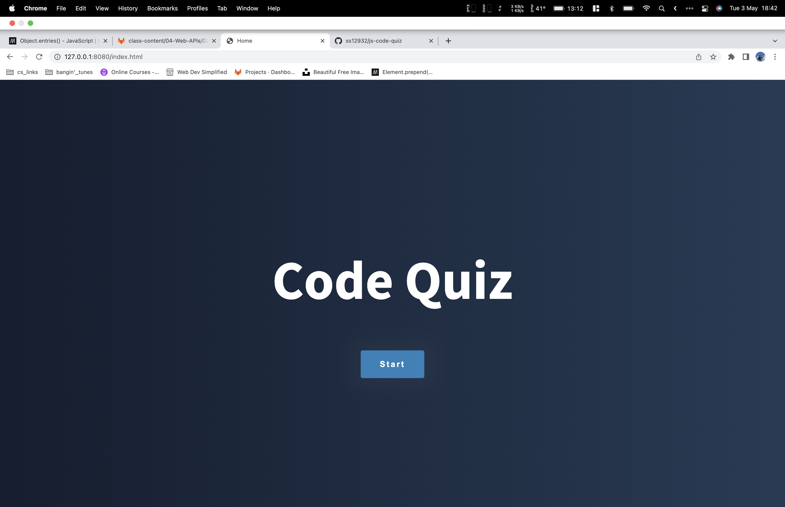
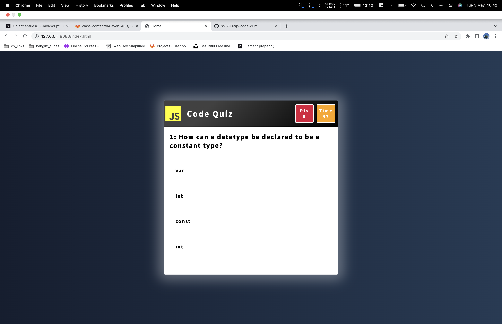

# js-code-quiz

## Overview

This week's assignment is to create a timed coding quiz with multiple choice questions. The application will run in the browser and will feature dynamically generated HTML and CSS powered by Javascript. It will also feature a highscore section to gauge progress with fellow peers.

## Deployed Link

https://ss12932.github.io/js-code-quiz/

## Github Repository Link

https://github.com/ss12932/js-code-quiz

## Application Screenshot





## User Story

```
GIVEN I am taking a code quiz
WHEN I click the start button
THEN a timer starts and I am presented with a question
WHEN I answer a question
THEN I am presented with another question
WHEN I answer a question incorrectly
THEN time is subtracted from the clock
WHEN all questions are answered or the timer reaches 0
THEN the game is over
WHEN the game is over
THEN I can save my initials and my score

```
## Package

None

## License

[](https://opensource.org/licenses/MIT)

## Contact

Please Contact me at ss12932@my.bristol.ac.uk
